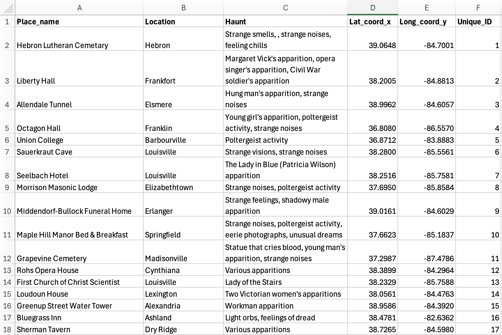
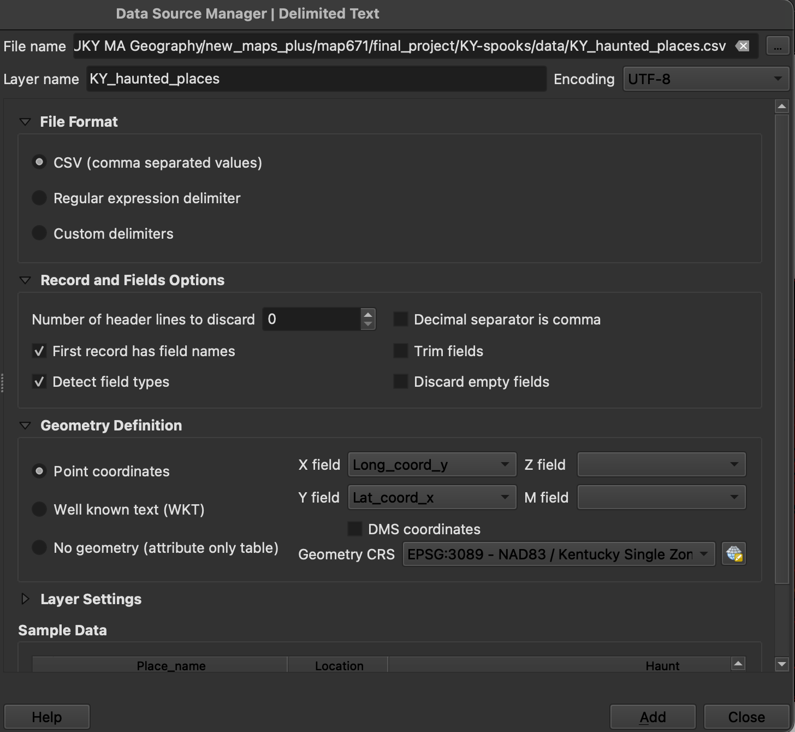
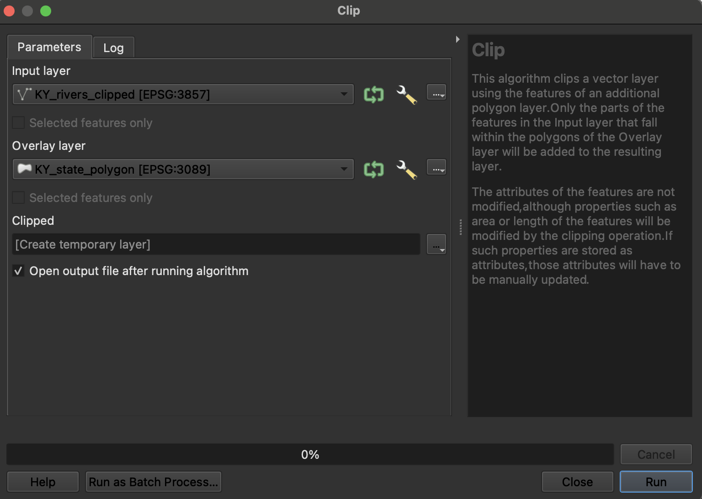
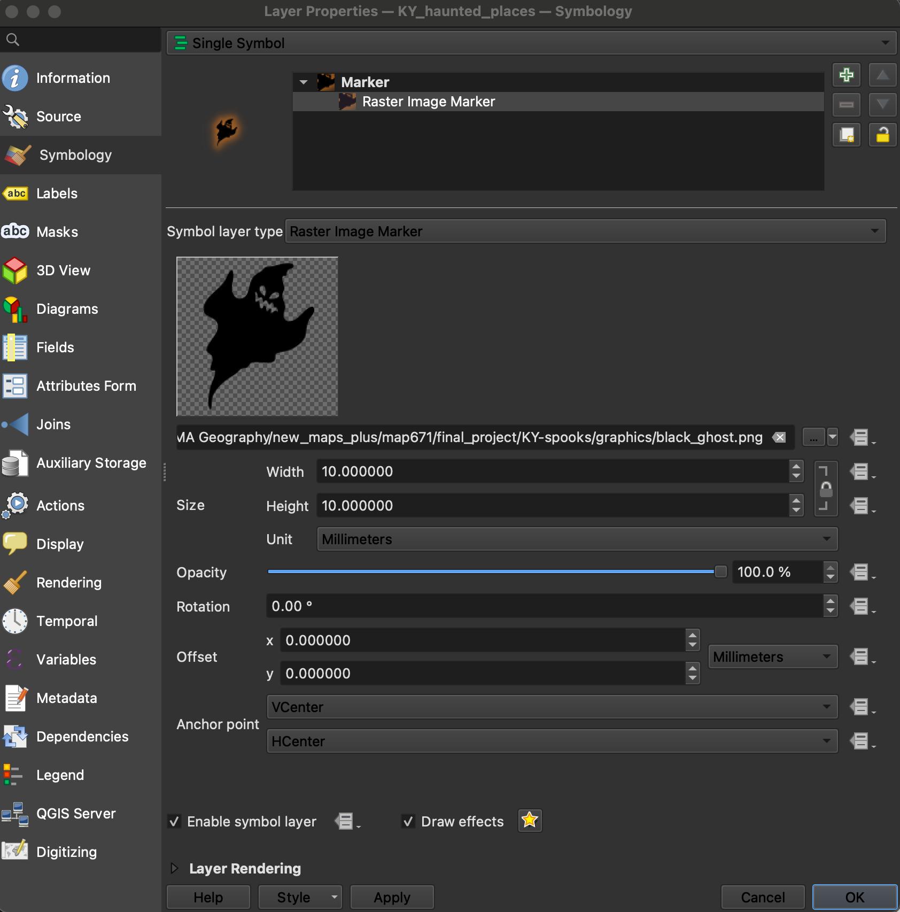
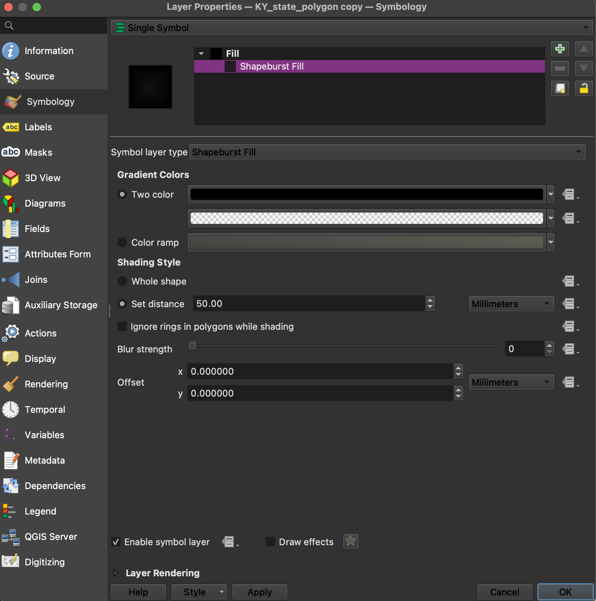
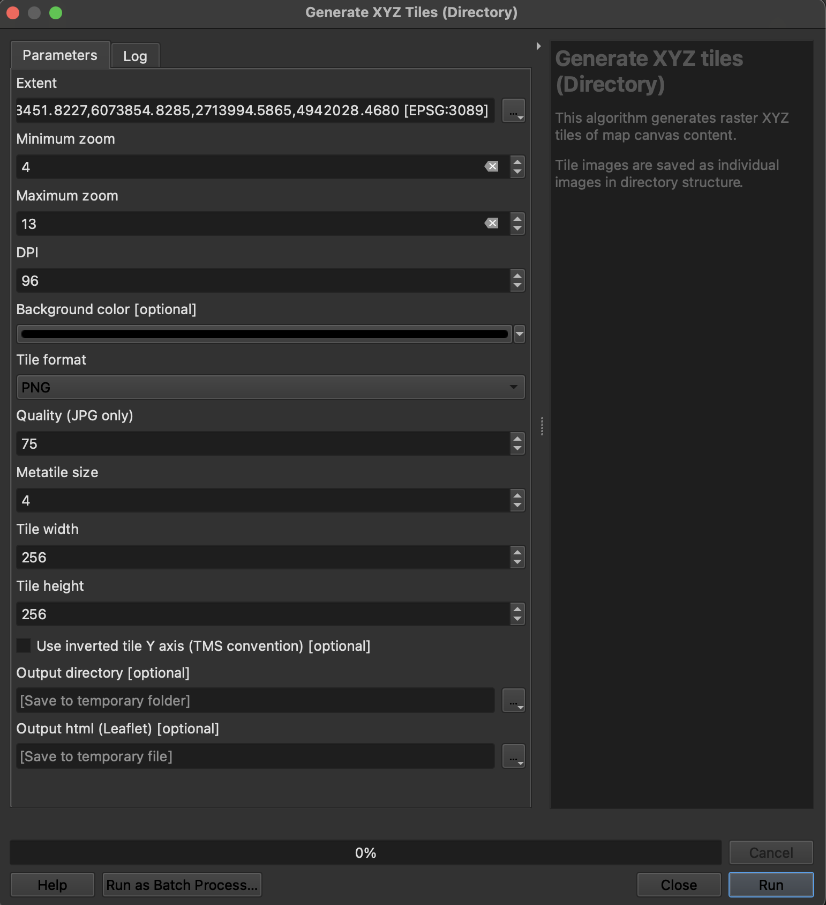
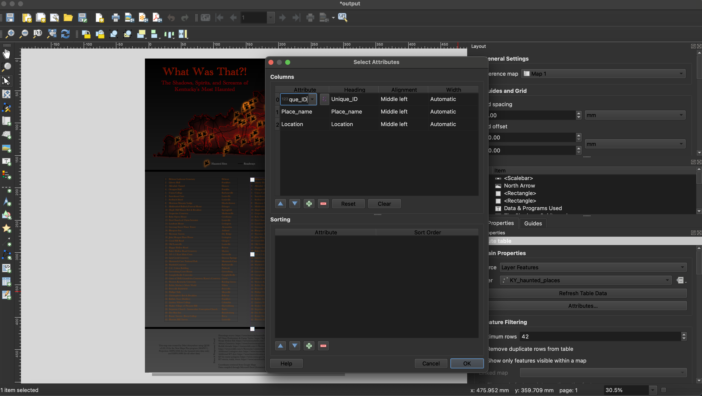
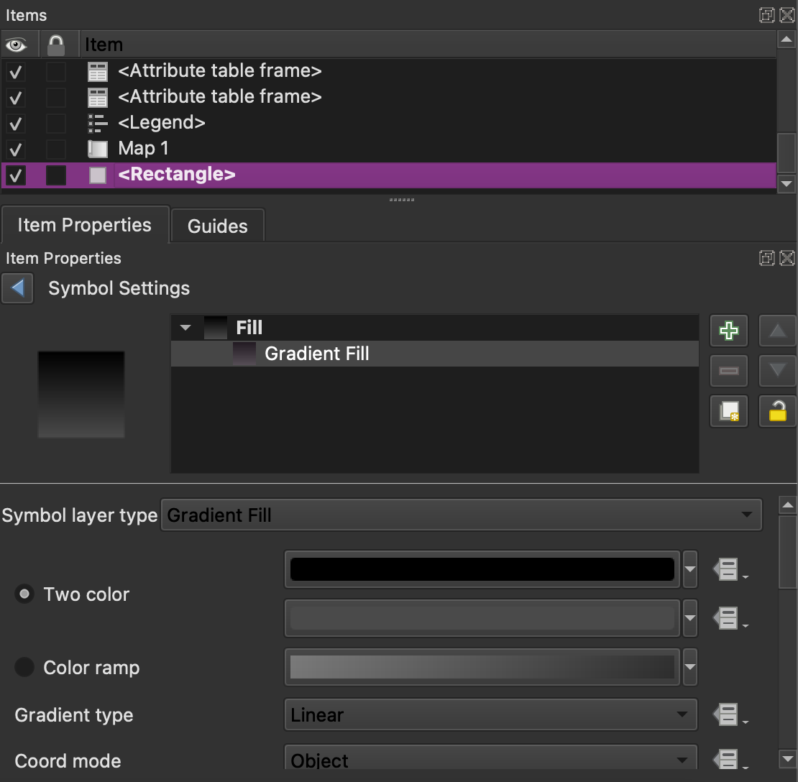
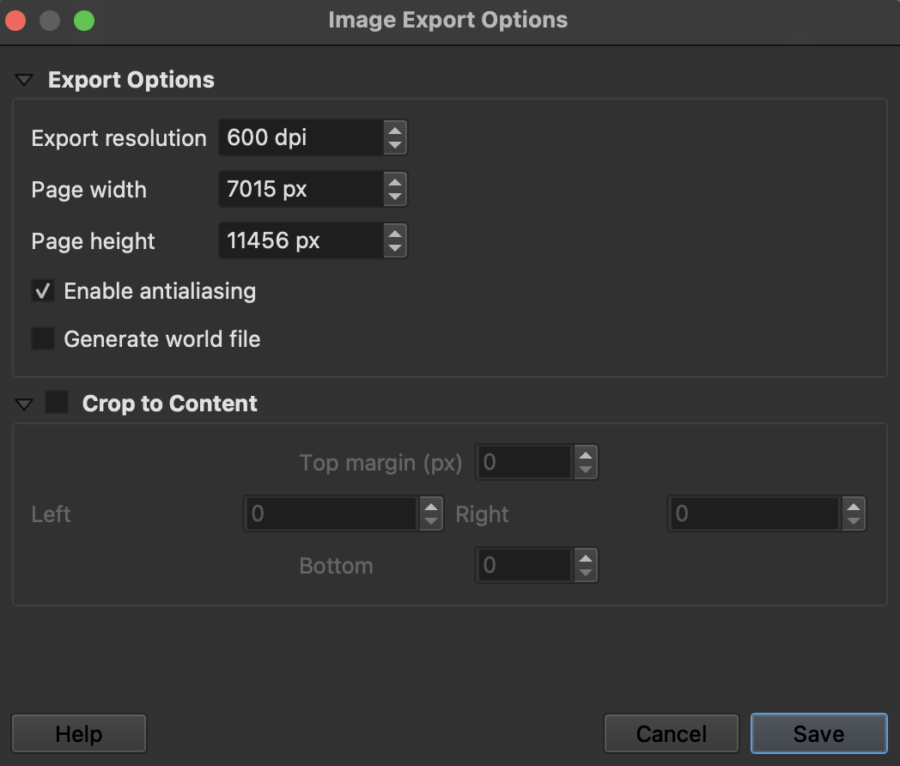
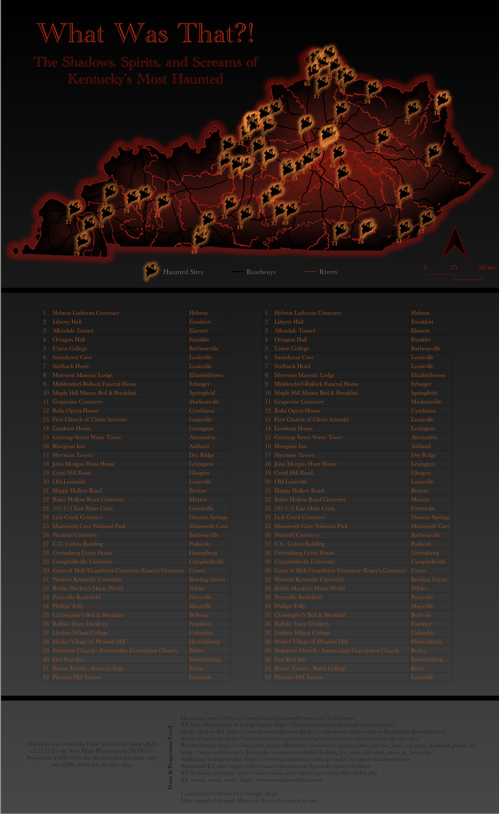

# Haunted Kentucky: Ghostly Visitations

Welcome to spooky Kentucky! This eerie map was created to illustrate the locations of all documented (to-date) haunted locations in Kentucky, which include any place that has anecdotally been recorded to have strange, unexplained occurences, including shadowy figures, disembodied voices, unexplained physical feelings, visual anomalies, and apparitions (among many other reported paranormal experiences). Since it's near Halloween, I decided to create a fun, spooky map for the season showing various hauntings around Kentucky. I'm quite interested in the stories of paranormal experiences, which fueled my desire to map these locations in Kentucky. Additionally, I created a similar map a few years ago illustrating popular haunted and abandoned locations in Kentucky. That map only featured five haunted locations, and I've always wanted to expand on it. Thus, this project was born!

## Haunted Sites Data Sources

The majority of haunted sites was compiled using information from [Kentucky Haunted Houses](https://www.kentuckyhauntedhouses.com/real-haunts/).Supplementary data for the Kentucky State Penitentiary, Camp Taylor, Sleepy Hollow Road, and Asbury Cemetery were sourced from these sites: 

* [KY State Penitentiary & Camp Taylor](https://kyforky.com/blogs/journalh/haunted-places)
* [Sleepy Hollow Road](https://www.kentuckybb.com/Blog/Get-Haunted-and-Go-Ghost-Hunting-in-Kentucky.html)
* [Asbury Cemetery](https://www.fourriversexplorer.com/asbury-cemetery-unusual-sights-ghostly-tales/)

Additional sites in Lexington and Kentucky were sourced from these sites:
* [Haunted Rooms (Lexington, Kentucky)](https://www.hauntedrooms.com/kentucky/lexington/haunted-places)
* [Haunted Rooms (Kentucky)](https://www.hauntedrooms.com/kentucky/haunted-places)

In rechecking my hauntings list, I referenced these Reddit threads to read about additional potentially haunted areas that I may have missed in my initial research:

* [Does anyone know of some haunted places in Eastern Kentucky? Particularly in the Pike/Letcher/Perry area?](https://www.reddit.com/r/Kentucky/comments/qxhrms/does_anyone_know_of_some_haunted_places_in/)
* [Looking for some haunted areas in Kentucky?](https://www.reddit.com/r/Kentucky/comments/c000hk/looking_for_some_haunted_areas_in_kentucky/)

All of this data was compiled on a spreadsheet in Microsoft Excel, with colums for place name, location (city), hauntings (reported paranormal experiences, simplified), and a unique ID for each site. It was then saved as a .csv (comma separated values) file for use in QGIS.

You can download the entire haunted data compilation here as a zip file: [KY_haunted_places.csv](data/KY_haunted_places.csv.zip) (click "view raw" to download)

## Other Data Sources

Data for the Kentucky state and county polygon data was sourced from the [U.S. Census Bureau](https://www.census.gov/cgi-bin/geo/shapefiles/index.php). Kentucky roads and river data was sourced from [Natural Earth Data](https://www.naturalearthdata.com") (1:10m scale). Lastly, the ghost raster image used to mark haunted locations was sourced from my previous spooky mapping project, which is the inspiration for this one. All data was clipped using the extent of Kentucky's state polygon.

## How the Map was Made

### 1. The Basics

The spooky adventure began with extensive research into Kentucky's haunted locations, with the intent of documenting every possible haunted location as I could along with their respective coordinates. I was lucky to find a compilation of 76 haunted locations in the Kentucky Hauted Houses website, which saved me quite a lot of time. Although I had to supplement that source with several others, it gave me a significant head start.

I began by creating an Excel spreadsheet to record my findings. It has six columns:
1. Place_name --> the site's name
2. Location --> the city/town it is located in
3. Haunt --> a simplified description of each site's reported paranormal experiences
4. Lat_coord_x --> the site's x-coordinate
5. Long_coord_y --> the site's y-coordinate
6. Unique_ID --> a unique numeric identifier given to each site

    
*Haunted locations Excel sheet*

This step took approximately 5-6 hours as I had to scour the documentations to codify paranormal experiences and note down coordinates (after checking their accuracy). Despite the time it took to compile this data, it was a lot of fun learning about each site's spooky personality!

### 2. Getting the Supplementary Data

The second step in my spooky journey consisted of finding all the other supplementary data to really bring out the spookiness of the haunted locations data. In my planning phase, this data ended up being:

* 2x KY state polygon layers
* KY counties polygons
* KY rivers
* KY major roadways
* Ghost image (this was very important)

Some of this data was obtained through my previous projects (to save download space). Of course, all the data I added would need to be clipped to the KY state extent accordingly. And that leads to probably the most difficult part of this project: mapping it all out in QGIS!

### 3. QGIS and the Project Output Construction

Once all the data had been compiled into one space (namely my downloaded_data and modified_data folders), I fired up QGIS and got to work. I was tempted many times to do the more challenging stylizations of this map through a program like Adobe Illustrator, but I wanted to challenge myself by only using QGIS for everything from data compilation to map design. And here began the arduous journey to shape my packets of data into something resembling a scary map!

Here are the specific steps to adding my data:
1. Add all vector layers by dragging and dropping the shapefiles or following the pathing **Layer** --> **Add Layer** --> **Add Vector Layer**
2. Add the .csv file by following the pathing **Layer** --> **Add Layer** --> **Add Delimited Text Layer** (for this, the X and Y values should be set to long_coord_y and lat_coord_x, respectively)

    
*Parameters for adding .csv data*

**Setting Projections & Clipping Data**
The first step to properly compiling my data was to set the correct project. For most of the data, a projection of EPSG:3089, the Kentucky-specific coordinate system, would suffice and as such, that is what I set after going to **Project** --> **Properties** --> **CRS** --> **Search for 3089**. The original projections for the state polygon and counties data was EPSG:4269 and for the roads and rivers, it was EPSG:4326.

However, I encountered an interesting and frustrating issue when trying to project my csv data with EPSG:3089--it appeared to be settled to the southwest of the state polygon and was much too small. I soon discovered that setting the csv layer's CRS to EPSG:4326 fixed the problem (this only applies to the csv data).

Next, I clipped all the data (excluding the csv) to Kentucky using **Select by Expression** on the Attribute Table toolbar or by selecting the features manually (this was used only for the KY polygon). For the KY counties polygon, the expression went something like this: "STATEFP" = '21'. For rivers and roads, I used the Clip tool (**Vector** --> **Geoprocessing** --> **Clip**) to clip those two layers using the extent of the KY polygon as reference.

    
*Clipping to the KY polygon extent*

**Styling the Data**
Here's the most fun (and perhaps a bit frustrating part)--styling the csv data so it looks fire! For my spooky map, I wanted the haunted sites markers to be displayed by little glowing ghosts. To do that, I followed this workflow:

1. Open up layer properties and go to symbology
2. Replace the "Simple Marker" with a "Raster Image Marker" (this is that ghost svg)
3. Make the ghost image as big as needed
4. Select "Draw Effects" at the very bottom (click the star)
5. Choose "Outer Glow" and modify it according to what is desired 
6. Click apply and watch the magic happen!

    
*Parameters for styling the ghost*

Next, I moved onto styling the rivers and roads layers. These were fairly simple, as I only changed the colors and line width of both. For rivers, I colored the Simple Line a semi-dark red and left the line thinkness fairly thin. For roads, I colored the Simple Line pure black and made it a bit thicker to stand out.

For theh KY counties, I only changed the Simple Fill to a vibrant, semi-dark red (lighter than the color for the rivers) and the stroke to a semi-dark gray. The KY polygon was where the really interesting styling happened.

First, I made a duplicate of the KY state polygon layer, which I placed above the KY counties layer. Then, I went into its Symbology tab and styled the layer to have a black shapeburst fill, being mindful to set the distance so it wouldn't cover the counties (which was also done by using the Two-Color scheme and making the second color transparent).

    
*Styling the shapeburst fill for the KY state polygon*

Finally, I styled the original KY state polygon layer to have a Simple black Fill and a soft light-gray outer glow. This would give the back of the state a bit of a subtle, foggy glow. I had planned to have the glow be sporadically placed like real fog, but unfortunately couldn't find a way around it. This outer glow workflow was the closest second. When taken together, all these stylings merge to create one spooky-looking red and black map--exactly as intended!

**Making the Interactive Zoom Map**
Considering that I had 84 haunted sites to display, I felt that having a zoomable map with place names might be very beneficial to easily see where and what these sites are. To do that, I used the tool "Generate XYZ tiles (Directory)" from the processing toolbox (**Raster Tools** --> **Generate XYZ tiles (Directory)**). I wanted to create a fairly high-zoom map and as such set my zoom extent to display 4 as the min zoom and 15 as the max zoom. I did this through two different runs (4-13 and 14-15) as the tool would take a hefty bite out of my poor MacBook's processing power. Doing a 4-15 zoom level run took about 45 minutes and over 1000% of my CPU--this is primarily the reason I split up the processes to two parts. See my parameters for the tool below (if following this workflow, make sure to save the file into a directory and as a file):

    
*Tile creation for intereactive map*

It still took the better part of 20 minutes, but the processes finished much faster as two steps instead of one. Once that was done, I combined all of the individual tile folders into one folder titled "Tile_15". A few tweaks in the related HTML file and viola--a pretty sweet zoomable map with all the haunted place names!

**Making the Print Layout**
Here's where the map really comes to fruition! This is also where my personal challenge of only using QGIS came directly into the arena. This is the story of my many headaches and emergent victories!

Here is the basic workflow for getting my map onto the print layout:
1. **Project** --> **New Print Layout** --> select name and hit "OK"
2. Add the map using the "Add Map" button on the left
3. Add the legend using the "Add Legend" mao button on the left

Once I had all this added, I went right to work getting all the layouts as precise as possible. I wanted a more vertical-heavy layout as I wished to add in an extensive legend matching each haunted site number with its unique ID, name, and location. To do that, I first extended the page height to 485mm then added in two attribute tables (42 row limit each) from the "Add Attribute Table" button on the bottom left. Upon addition of the two table, I modified each table to only display three columns: Unique_ID, place_name, and Location (**click on layer** --> **go to "Main Properties"** --> **"Attributes"**).

    
*Attribute table styling in print layout composer*

Next, I added a title, a subtitle, data sources, and map attribution to the output, styling them all accordingly to fit into the map's spooky theme (AKA the attribute tables were orange, the titles red, and the legend text and data & attributions a semi-light gray). As a note, I used two specific fonts for this map: Academy Engraved LET (for the title and subtitle) and Baskerville (for everything else).

Lastly, I tackled the background. Since I wanted it to have a bit of a gradient (black on top fading to a semi-light gray at the bottom), I first drew a rectangle from the "Add Shape" tool and styled it using a Two-Color gradient fill. This added that soft gradient and served as a fine background (after putting it behind every other layer). 

    
*Styling the gradient rectangle background*

And that's it! There was a bit of experiementing around for a good hour before settling on a good set of designs, but it was well worth the couple hours. The final task would be to add a direction arrow and a scale bar, which I blended in with the rest of the map.

Lastly, the only thing left to do is export the maps into a PNG. I exported my maps at 600 and 1200 dpi--see my basic workflow below:
1. Click "Export as Image" on the top toolbar
2. Select a location to save
3. Change the resolution to 600dpi (and do another for 1200dpi afterwards)
4. Save and enjoy!

    
*Output resolution*

And that's how you design an eye-catching spook entirely on QGIS!

### 4. The Final Map and Coding HTML & CSS

Here's a screenshot of the final map!

    
*Final map screenshot*

Now since I'd finished making the actual map, it was time to display it in all its spooky glory in an index.html file. I wanted to do something a little different from the index.html templates provided in class. As such, I used the templace for my cartography portfolio, as I felt that fit better with the way I wanted to display my static map, the interactive map, and my data sources. I copied over the HTML code from my porfolio file and set about making a number of changes to customize it to my spooky map, including overhauling the background & font colors, removing some features for ease of use, and other minor changes. As perhaps expected, coding this template to fit my desires took quite a few hours of trial, error, and many Internet searches. However, it all turned out well and I learned some valuable skills from stumbling along!

Additionally, I incorporated the leaflet file I had created through the generate tiles tool in QGIS into the index.html file, making a space to display the interactive map. Getting the map to actually display took some time, but a few tweaks to the filepath set the code right on track!

### 5. Get Ready for the Spooky

If you've read this far, congratulations! I will now reveal the consolidation of all the maps, data, and coding this documentation (and the better part of a day) has been poring over. Get ready for the scares of a lifetime!

Index.html page: [Haunted Kentucky: Ghostly Visitations](https://dtabeyrathne.github.io/KY-spooks/)

## Many thanks for reading, and Happy early Halloween! I hope this map is as fun to view as it was to create!